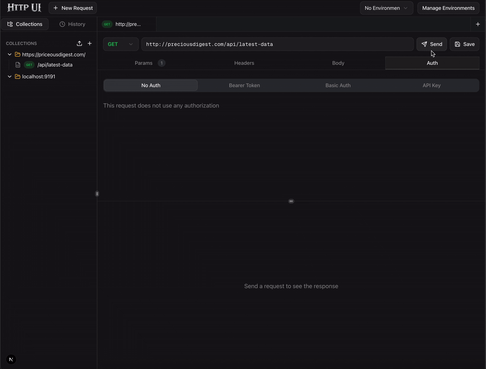

# HTTP UI

A modern, lightweight HTTP client for testing and debugging APIs. Built with Next.js and designed to be fast, intuitive, and self-hosted.


## Demo



## Features

- **Request Builder** — support for GET, POST, PUT, PATCH, DELETE, HEAD, and OPTIONS methods with query parameters, headers, and multiple body types (JSON, form-data, x-www-form-urlencoded, raw text)
- **Tabbed Interface** — work with multiple requests simultaneously, with dirty-state tracking for unsaved changes
- **Collections** — organize requests into collections and nested folders with drag-and-drop reordering
- **Environment Variables** — define global and environment-scoped variables, use `{{variables}}` in URLs, headers, body, and auth fields
- **Authentication** — built-in support for Bearer tokens, Basic auth, and API keys (header or query parameter)
- **Response Viewer** — color-coded status codes, response time, size, syntax-highlighted body (JSON/XML/HTML), response headers, copy-to-clipboard, and download
- **Request History** — automatically tracks all executed requests
- **Import/Export** — share collections as JSON files
- **Resizable Panels** — adjustable sidebar, request, and response panel sizes
- **Dark Mode** — toggle between light and dark themes
- **Self-Hosted** — your data stays on your machine in a local SQLite database

## Getting Started

### Prerequisites

- Node.js 18+
- npm (Node Package Manager)

### Installation

1. Clone the repository:

   ```bash
   git clone https://github.com/liringlas/http-ui.git
   cd http-ui
   ```

2. Install dependencies:

   ```bash
   npm install
   ```

3. Set up the database:

   ```bash
   npx prisma generate
   npx prisma db push
   ```

4. Start the development server:

   ```bash
   npm run dev
   ```

5. Open [http://localhost:3001](http://localhost:3001) in your browser.

## Keyboard Shortcuts

| Action       | macOS                  | Windows/Linux          |
| ------------ | ---------------------- | ---------------------- |
| Save Request | `Cmd+S`                | `Ctrl+S`               |
| Send Request | `Enter` (in URL field) | `Enter` (in URL field) |

## Tech Stack

- **Framework**: [Next.js 16](https://nextjs.org/) with App Router
- **UI**: [React 19](https://react.dev/), [Tailwind CSS 4](https://tailwindcss.com/), [Radix UI](https://www.radix-ui.com/), [shadcn/ui](https://ui.shadcn.com/), [Lucide Icons](https://lucide.dev/)
- **State**: [Zustand](https://zustand-demo.pmnd.rs/) (client), [TanStack Query](https://tanstack.com/query) (server)
- **Database**: [SQLite](https://www.sqlite.org/) with [Prisma](https://www.prisma.io/)
- **Editor**: [Monaco Editor](https://microsoft.github.io/monaco-editor/)
- **DnD**: [@dnd-kit](https://dndkit.com/) for drag-and-drop
- **Layout**: [react-resizable-panels](https://github.com/bvaughn/react-resizable-panels)
- **Validation**: [Zod](https://zod.dev/)

## Project Structure

```
src/
├── app/
│   ├── api/              # API routes (collections, folders, requests,
│   │                     #   environments, variables, history, execute)
│   ├── layout.tsx        # Root layout with providers
│   ├── page.tsx          # Main application page
│   └── globals.css       # Global styles & CSS variables
├── components/
│   ├── layout/           # App shell, header, sidebar, tab bar
│   ├── collections/      # Collection tree sidebar
│   ├── history/          # Request history list
│   ├── environments/     # Environment manager & switcher
│   ├── request-builder/  # URL bar, headers, body, auth editors
│   ├── response-viewer/  # Response display & JSON viewer
│   ├── ui/               # Reusable UI components (shadcn/ui)
│   └── providers.tsx     # TanStack Query & theme providers
├── hooks/                # React Query hooks (collections, environments, history, execute)
├── store/                # Zustand store (tabs, active request, UI state)
├── lib/                  # Prisma client, HTTP client, variable resolver, utilities
└── types/                # TypeScript type definitions
```

## Contributing

Contributions are welcome! Please feel free to submit a Pull Request.

1. Fork the repository
2. Create your feature branch (`git checkout -b feature/amazing-feature`)
3. Commit your changes (`git commit -m 'Add some amazing feature'`)
4. Push to the branch (`git push origin feature/amazing-feature`)
5. Open a Pull Request

## License

This project is licensed under the MIT License
